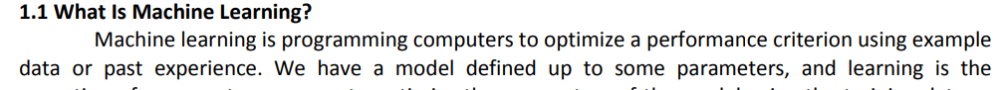
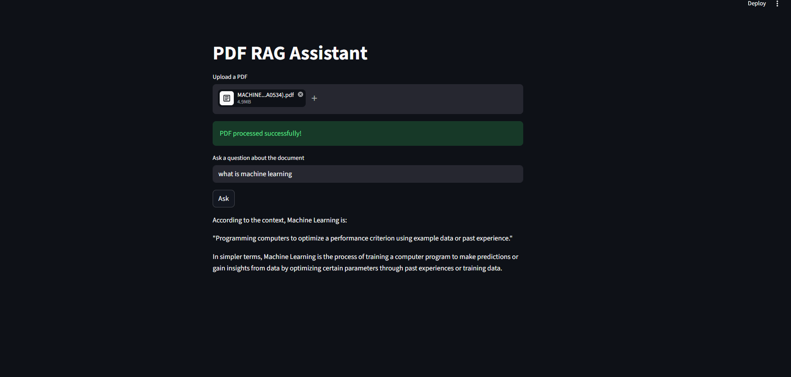

# 📄 PDF RAG Assistant

A **Retrieval Augmented Generation (RAG) based PDF Question Answering System** that allows users to upload a document and ask questions about its content.  
The system retrieves relevant information from the document and generates accurate answers using a Large Language Model.

---

# 🚀 Project Overview

This project implements a **Document Question Answering system** using **RAG (Retrieval Augmented Generation)**.

Instead of relying only on an LLM’s training data, the system retrieves relevant information from the uploaded document and uses it as context for generating answers.

### Key Idea
<pre>
User Question
↓
Convert question to embedding
↓
Search similar document chunks
↓
Send retrieved chunks + question to LLM
↓
LLM generates answer
</pre>

This ensures the response is **grounded in the uploaded document**.

---

# 🖼 Example Document Input

Below is a sample section from the PDF used in the system.

---

# 🖥 Application Interface

The application provides a simple interface where users can upload a PDF and ask questions.

---

# ⚙️ Technologies Used

- **Python**
- **Streamlit** – Web interface
- **ChromaDB** – Vector database
- **Sentence Transformers** – Text embeddings
- **Groq LLM API** – Language model inference
- **LangChain Utilities** – Document loading & splitting
- **PyPDF** – PDF parsing

---

# 🧠 RAG Pipeline Architecture

The project follows a **Retrieval Augmented Generation pipeline**.

            +-------------------+
            |     PDF File      |
            +---------+---------+
                      |
                      v
            +-------------------+
            |  Document Loader  |
            | (Extract text)    |
            +---------+---------+
                      |
                      v
            +-------------------+
            |   Text Splitter   |
            | (Chunk document)  |
            +---------+---------+
                      |
                      v
            +-------------------+
            |   Embedding Model |
            | SentenceTransform |
            +---------+---------+
                      |
                      v
            +-------------------+
            |    ChromaDB       |
            |  Vector Storage   |
            +---------+---------+
                      |
            User Question
                      |
                      v
            +-------------------+
            | Query Embedding   |
            +---------+---------+
                      |
                      v
            +-------------------+
            | Similarity Search |
            +---------+---------+
                      |
                      v
            +-------------------+
            | Retrieved Chunks  |
            +---------+---------+
                      |
                      v
            +-------------------+
            |        LLM        |
            | (Groq / Llama)    |
            +---------+---------+
                      |
                      v
            +-------------------+
            | Generated Answer  |
            +-------------------+

---

# 🔎 How the System Works

## 1️⃣ Document Upload
The user uploads a **PDF document** through the Streamlit interface.

The system extracts the text from the document using **PyPDFLoader**.

---

## 2️⃣ Text Chunking

Large documents cannot be processed directly by embedding models.

Therefore the document is split into smaller **text chunks**.

Example:
<pre>
  Chunk 1
Machine learning is programming computers to optimize a performance...

Chunk 2
Learning algorithms improve performance based on experience...
</pre>

---

## 3️⃣ Embedding Generation

Each chunk is converted into a **vector embedding** using a transformer model.

---

## 4️⃣ Vector Storage (ChromaDB)

All embeddings are stored in **ChromaDB**, which is a vector database.

This allows fast **similarity search**.

---

## 5️⃣ User Question Processing

The system converts the question into an **embedding vector**.

---

## 6️⃣ Similarity Search

The vector database searches for **document chunks that are semantically similar** to the question.

---

## 7️⃣ Response Generation

The retrieved text chunks are sent to the **LLM along with the question**.

---

# 💡 Features

✔ Upload any PDF document  
✔ Ask questions about the document  
✔ Semantic search using embeddings  
✔ Context-aware answers using LLM  
✔ Simple web interface  

---

# 📈 Future Improvements

- Multi-document support
- Chat history
- Highlight answer sources
- Faster embedding pipelines
- Hybrid search (keyword + vector)

---

# 📜 License

This project is open-source and available under the **MIT License**.

---

# 👨‍💻 Author

Developed as a **Generative AI project demonstrating Retrieval Augmented Generation (RAG)** for document question answering.
